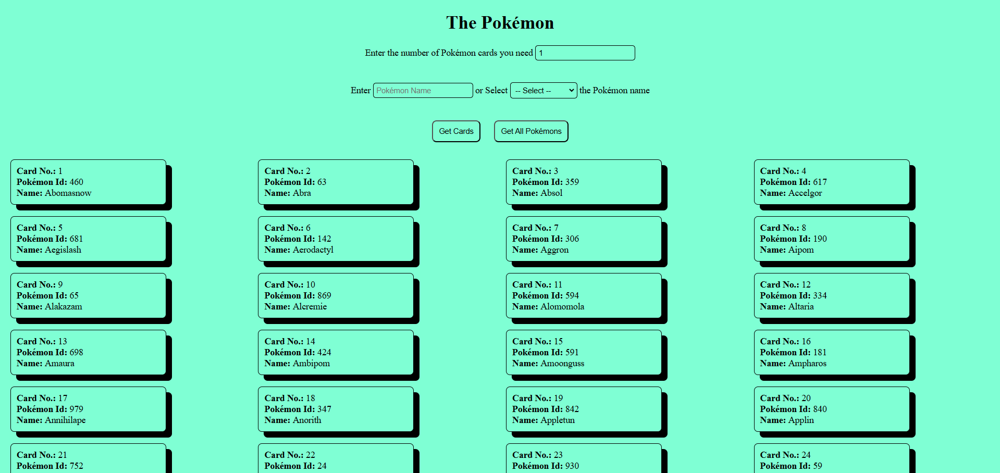

# The-Pokémon

Your task is to design and implement an application that display Pokémon Cards.

- user comes to site and enter number of cards and select category of Pokémon.

**Hint**: take category and no of Pokémon, use API and render.

## Resources:

- refer this: https://pokeapi.co/
- use this `https://pokeapi.co/api/v2/pokemon/${id}` api to get the pokemon data by id.

**Note**: here id is a number. for example `https://pokeapi.co/api/v2/pokemon/1`

## Landing page screenshot

## Error handling screenshots

## On clicking "Get Cards" button screenshot

## On clicking "Get All Pokémons" button screenshot

