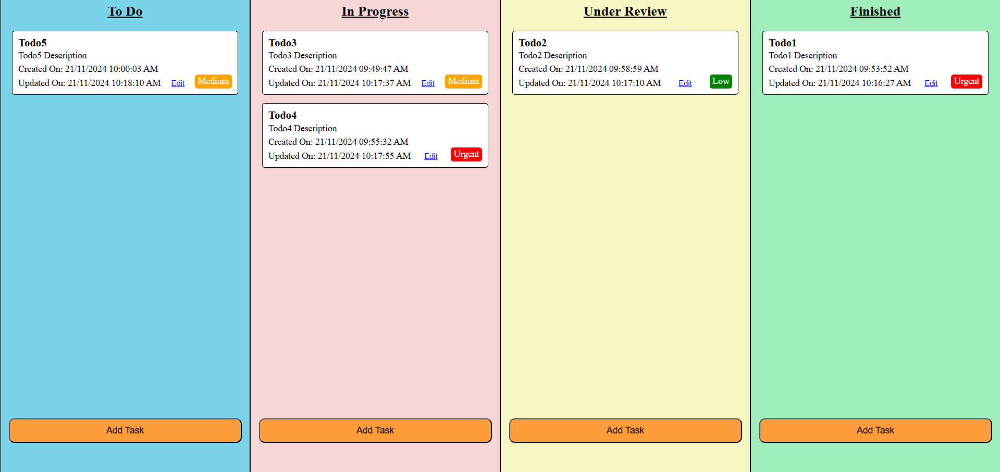
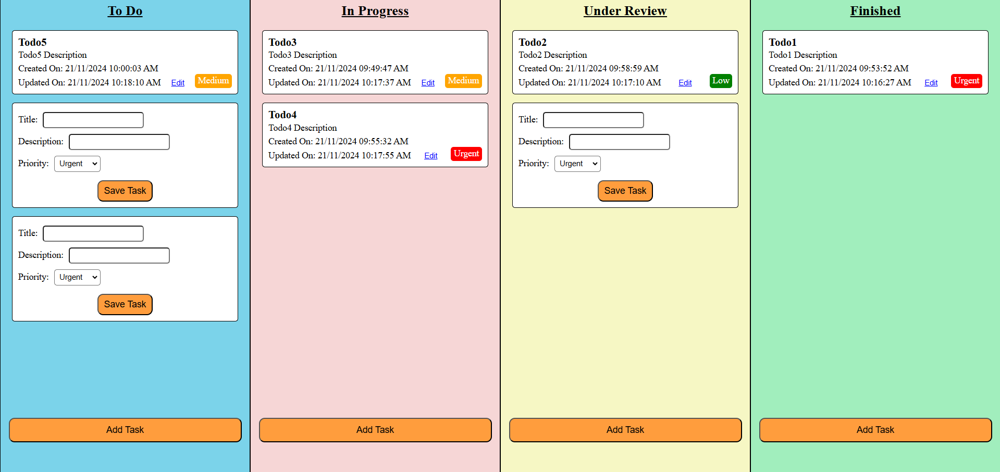
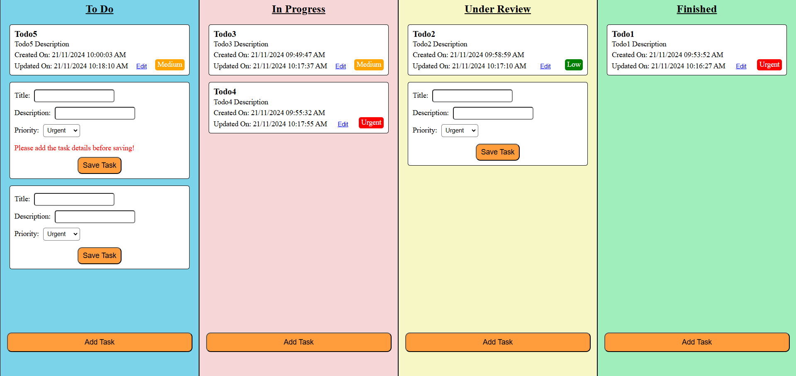
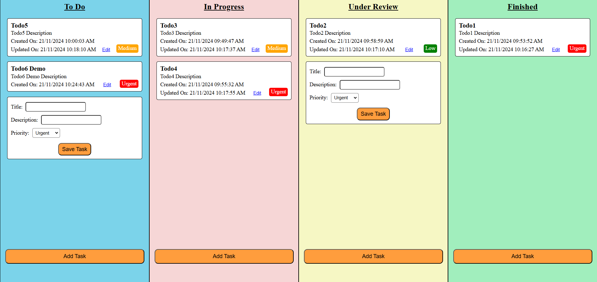
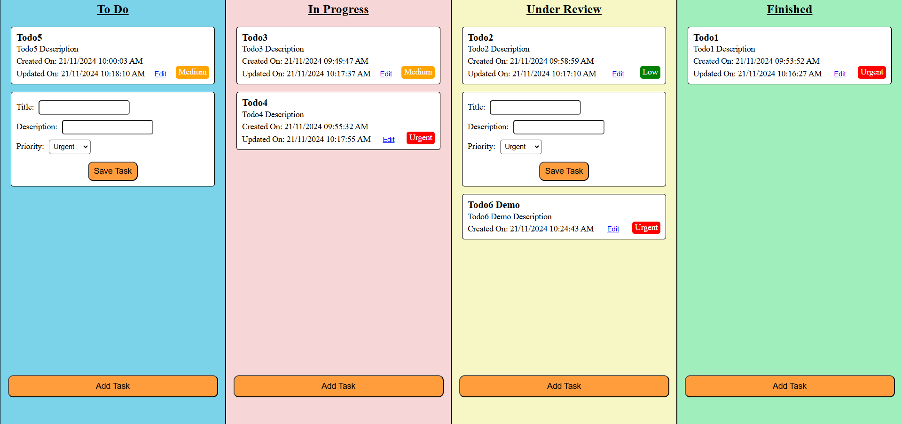
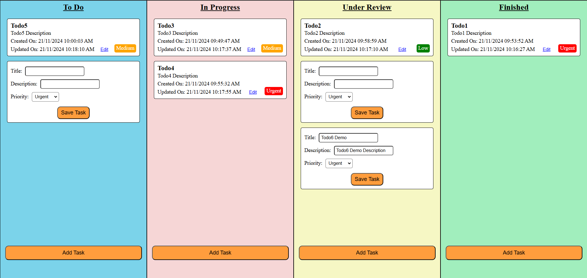
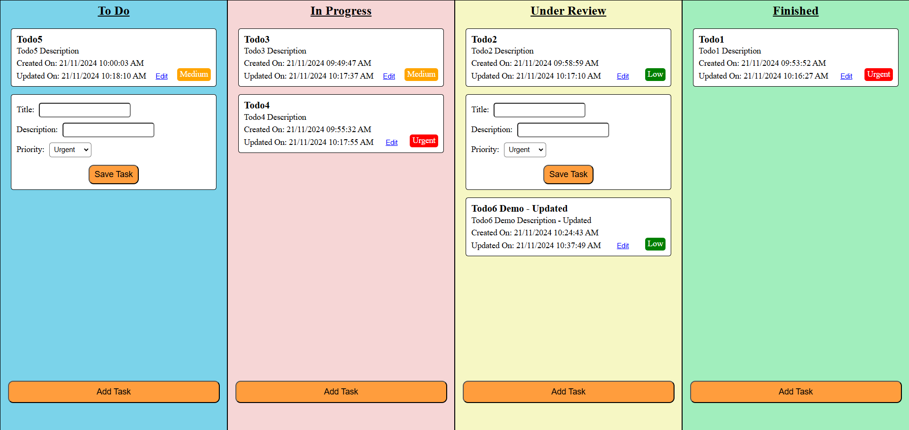
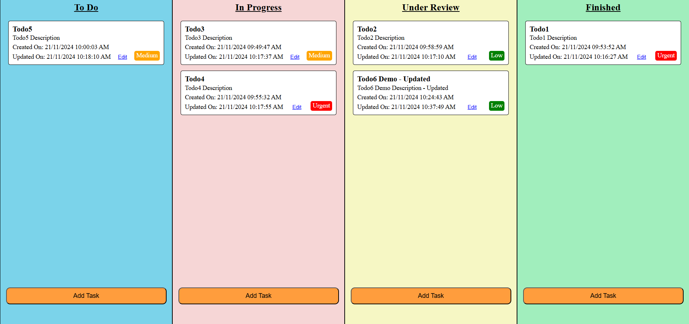

# Taskify

- Create a Task Management Application with drag-drop functionality between the category.

- you can avoid time, and type of TODO (easy, medium, hard).

- The UI should resemble the example shown below..

### Don't copy UI as it is, only take reference from it.

## Landing page screenshot

## Add Task button click screenshot

## Error handling screenshot

## After saving the todo screenshot

## After changing the state of the newly created todo screenshot

## After clicking the edit button of the newly created todo screenshot

## After saving the updated todo screenshot

## Reloading the page and fetched the todos from the localStorage screenshot

